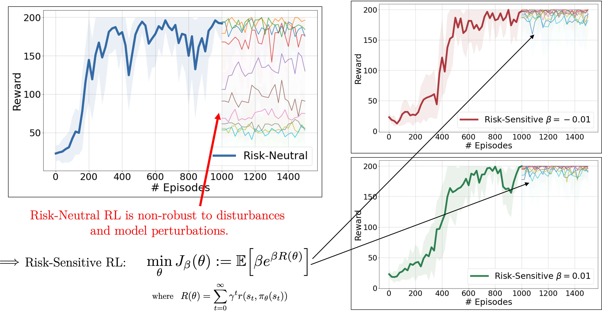

# Risk-Sensitive Reinforcement Learning

> Policy Gradient Algorithms (from REINFORCE to Actor-Critic) for Risk-Sensitive Reinforcement Learning




## Contact 

Christos N. Mavridis, Ph.D. \
Department of Electrical and Computer Engineering, \
University of Maryland \
https://mavridischristos.github.io/ \
```mavridis (at) umd.edu```


## Demo

Run

    rsrl.train(risk_beta=0)
    rsrl.train(risk_beta=-0.1)
    rsrl.train(risk_beta=0.1)


## Hyper-Parameters

### Project Name

> name = '' 

    # For saving model and results
    # If empty, project name includes all hyper-parameters used


### Game

> game='cartpole'

    # Any Gym environment
    # Supported here: 'cartpole', 'acrobot'


### Risk-Sensitive Parameters

> risk_beta = -0.1

    # J = risk_beta * exp( risk_beta * R )
    # 0 corresponds to the risk-neutral case: J = R
    # Typical values: [-0.5, -0.1, -0.01, 0 , 0.01, 0.1, 0.5]

> risk_objective = 'BETA' 

    # 'BETA': J = risk_beta * exp( risk_beta * R )
    # 'BETAI': J = 1/risk_beta * exp( risk_beta * R )
    # 'BETAS': J = sgn(risk_beta) * exp( risk_beta * R )

> gammaAC = 0.99

    # R = \sum_t gammaAC**t r_t    
    # diminishing returns: gammaAC in [0,1)


### REINFORCE vs Actor-Critic

> look_ahead = 0

    # 0: REINFROCE
    # 1: TD Actor-Critic
    # >1: Batch Actor-Critic

> baseline = False

    # Include Baseline in REINFORCE
    # Baseline is computed using a critic NN


### Training Loops

> train_loops = 100

    # Number of train loops
    # Increase train_loops to decrease nepochs as discussed bellow

> test_loops = 50

    # Number of test loops

> nepochs = 10

    # Number of epochs in each train loop
    # Controls the batch size over which the performance statistics are computed

> time_steps = 200 

    # Number of maximum timesteps (when no failure) in each epoch
    
    # for k in range(train_loops):
    #     for i in range(nepochs):
    #         for t in range(time_steps):
    #             observe
    #             act
    #             (update actor-critic)
    #         (update reinforce) 
    #         gather statistics (average score, variance, etc.) for every epoch 
    
### Neural Networks and Learning Rate

> nn_actor = [16]

    # Number of neurons in the actor neural network
    # Supports up to two layers, e.g., [32,16]

> nn_critic = [16]

    # Number of neurons in the critic neural network
    # Supports up to two layers, e.g., [32,16]
    
> lr = 0.01

    # Learning rate for Adam optimizer
    # Very important parameter for convergence: high sensitivity  

> cut_lr = False

    # mannually decrease learning rate if desired average score is reached
    # (developer mode)

> a_inner = 0.0 

    # Update learning rate according to stochastic approximation theory
    # lr = lr * 1/(1 + t * a_inner) where t is the timestep
    # 0 for no decreasing

> a_outer = 0.0

    # Update learning rate according to stochastic approximation theory
    # lr = lr * 1/(1 + k * a_outer) where k is the train loop
    # 0 for no decreasing

### Model Variations

> model_var = [round(0.2*(i+1),1) for i in range(10)]

    # Testing in environments with different model parameters
    # The changing parameter is pre-specified for each environment but can change (see Testing Loops) 
    # Nominal values: length=0.5 for cartpole, LINK_LENGTH_1=1.0 for acrobot
    
### Random Seed

> rs = 0

    # Random seed used for everything (Gym environment, random, np.random, and torch (NNs))
    # (developer mode)
    
